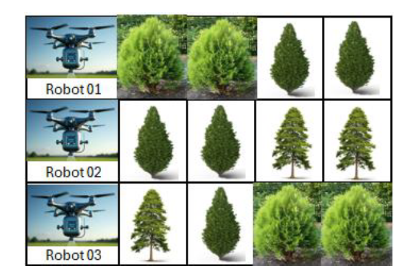

# IPC2_Proyecto2_201318644
# Propuesta
# GuateRiegos 2.0

La empresa ha creado un sistema innovador para optimizar la cantidad de agua, fertilizante y el tiempo necesario para mantener saludables los cultivos en ivnernaderos 

Un invernadero está formado por hilereas o filas de cultivos. Cada hilera tiene X plantas y cada planta ocupa exactamente 1 metro cuadrado de espacio. 

La empresa ha construido robots regadores, estos robots son drones con un sustema de riego y aplicación de fertilizante incorporado, estos drones pueden ser programados para volar un metro hacia adelante, un metro hacia atrás, o bien, aplicar el fertilizante y el agua. 

Cada planta requiere una cantidad específica de litros de agua y una cantidad de gramos de fertilizante para sobrevivir y crecer saludablemente. Además cada planta tiene su propio calendario de riego,

## Proceso de riego
Consiste en colocar un robot regador al inicio de cada hilera de cultivos y configurar el plan de riego y aplicación de fertilizante que se desea aplicar al invernadero.

Por ejemplo para una configuración inicial de 3 hileras y 4 plantas en cada hilera, el plan de riego se configura de la siguiente forma: 

H1-P2, H2-P1, H2-P2, H3-P3, H1-P4 

Donde H representa la hilera y P representa la posición de la planta en esa hilera. 

El riego de las plantas debe realizarse en el orden indicado según el plan, solamente pueden regar una planta en un momento dado, es decir, no se deben regar 2 o más plantas al mismo tiempo en un invernadero

# Especificaciones 

1. Los drones regadores demoran 1 segundo en moverse 1 metro hacia adelante o hacia atrás. 
2. Los drones regadores demoran 1 segundo en regar una planta. 
3. Solamente 1 dron puede realizar la operación de regado en un momento dado en un invernadero. 
4. Los riegos deben de seguir el orden establecido en el plan de riego y aplicación de fertilizante configurado para el invernadero.
5. Para cada planta de cada hilera se establece la cantidad de agua en litro y la cantidad de fertilizante en gramos que se desea aplicar. 

# Caso de uso 
Para el invernadero que se mostró en la imagen anterior, se termina que cada planta requiere 1 litro de agua y 100 gramos de fertilizante y se configura el siguiente plan de riego y aplicación de fertilizante. 

H1-P2, H2-P1, H2-P2, H3-P3, H1-P4 

Se asignan los drones regadores de acuerdo con la siguiente tabla. 

|Hilera|Dron|
|-------|----|
|H1|DR01|
|H2|DR02|
|H3|DR03|

Instrucciones enviadas a cada Dron para ejecutar el plan de riego y aplicación de fertilizante por unidad de tiempo. 

|Tiempo|DR01|DR02|DR03|
|---|---|---|---|
|1 segundo|Adelante (H1P1)|Adelante (H2P1)|Adelante (H3P1)
|2 segundos|Adelante (H1P2)|Esperar|Adelante(H3P2)
|3 segundos|Regar|Esperar|Adelante (H3P3)
|4 segundos|Adelante (H1P3)|Regar|Esperar
|5 segundos|Adelante (H1P4)|Adelante(H2P2)|Esperar
|6 segundos|Esperar|Regar|Esperar
|7 segundos|Esperar|FIN|Regar
|8 segundos|Regar||FIN
|9 segundos|FIN||

Información para aplicar el plan de riego y aplicación de fertilizante robotizado al invernadero:

a. Tiempo para regado óptimo: 8 segundos

b. Agua requerida por dron:

    * DR01 - 2 litros
    * DR02 - 2 litros
    * DR03 - 1 litro
        Total 5 litros 

c. Fertilizante requerido por dron:

    * DR01 - 200 gramos
    * DR02 - 200 gramos
    * DR03 - 100 gramos
        Total 500 gramos

# Archivos de Entrada y Salida
## Archivo de Entrada

## Archivo de Salida

# Reportes
## Reporte HTML
Reporte HTML - ReporteInvernaderos.html

Para cada invernadero configurado en el sistema, se debe generar un reporte en HTML que muestre por cada plan de riego y aplicación de fertilizante configurado en dicho invernadero, los drones asignados a cada hilera (tabla 1), las instrucciones enviadas a cada dron en el tiempo (tabla2) y las estadísticas de uso de agua y fertilizante totales y por dron.
Este reporte se deberá generar por cada invernadero configurado un archivo de salida en
formato HTLM. queda a discreción del estudiante como representar la información, pero debe
considerar que debe observarse la actividad de cada Dron.
## Reporte TDA
Utilizando la herramienta Graphviz, se deberá crear un grafo mostrando el estado de los TDAs
utilizados para generar la funcionalidad de un plan de riego y aplicación de fertilizante. Este
grafo debe poder generarse en cualquier momento y debe mostrar el estado de los TDAs en
ese momento por medio de una opción en la interfaz de usuario que será descrita en la
siguiente sección. El siguiente es un ejemplo de una secuencia de trabajo graficada.

# Interfaz
Se debe crear una interfaz de usuario, en la que se puedan gestionar todas las acciones
necesarias para la ejecución lógica del proyecto, queda a discreción del estudiante como
elaborar su propio diseño para la aplicación, pero debe considerar la facilidad de uso por parte
del usuario.

La interfaz de usuario debe permitir realizar las siguientes operaciones:
* Debe existir una opción para cargar archivos con la configuración de invernaderos.
* Se debe poder seleccionar un invernadero y un plan de riego y aplicación de fertilizante,
según lo configurado en el archivo de entrada, para poder simular el proceso de riego.
    * Mostrar las estadísticas del proceso: tiempo óptimo para realizar el riego, litros de
agua ocupados por dron, gramos de fertilizante ocupados por dron.
    * Generar y mostrar el reporte html del proceso de riego y aplicación de fertilizante
automatizado para el invernadero y plan seleccionado.
    * Permitir al usuario definir un tiempo “t” en segundos. Generar y mostrar la gráfica
de estado de los TDAs en dicho momento utilizados para el proceso de riego y
aplicación de fertilizante automatizado para el invernadero y plan seleccionado.
Permitir cambiar el valor de “t” con el objetivo de evaluar el algoritmo utilizado para
optimizar el proceso de riego y aplicación de fertilizante en el invernadero y plan
seleccionados.
* Generar reporte HTML (ver sección Reporte HTML)
* Generar archivo de salida con los resultados para todos los invernadero y planes de riego
y aplicación de fertilizante configurados.
* Apartado de ayuda (Incluir información del estudiante, Acerca de la aplicación y enlace
hacia la documentación).
* Se tomará en cuenta la creatividad del estudiante.
* La interfaz de usuario debe ser web utilizando Flask.

# Documentación 
* Ensayo
* Diagrama de Clases
* Diagrama de Actividades